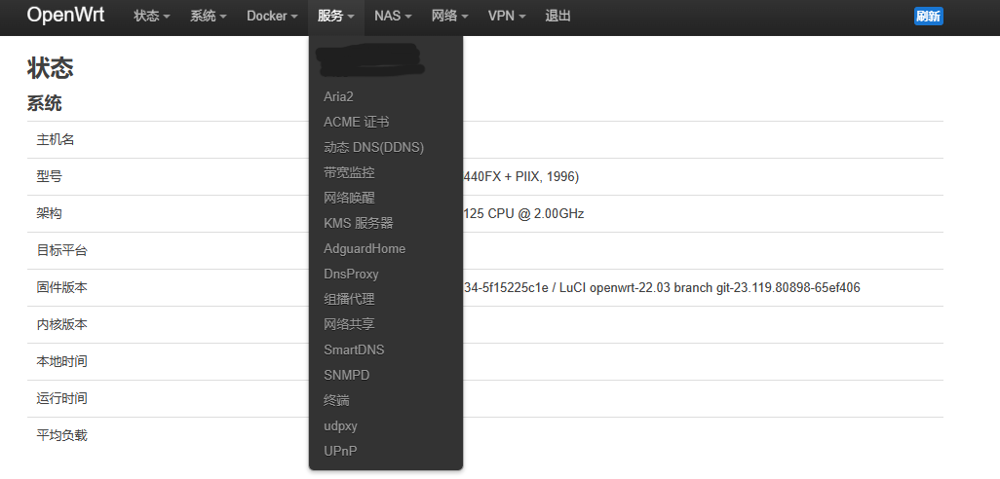

## 每月一号凌晨构建官方最新稳定版
## Example:
- 最新稳定版tag为v22.03.5
- feeds.conf.default中各仓库分支为 openwrt-22.03
- feeds.conf.default中本仓库分支为 main
- luci/luci-app-bundle-base/Makefile 应用集合
## Feature
- 支持AdguardHome,DnsProxy多进程
- 支持设备:x86,r2s,r4s,newifi-d2
## [Guide](https://blog.czy21.com/post/openwrt/build/)
## Screenshot

## Q&A
- RPC call to luci/getFeatures failed with error 
  - https://github.com/openwrt/luci/issues/6078